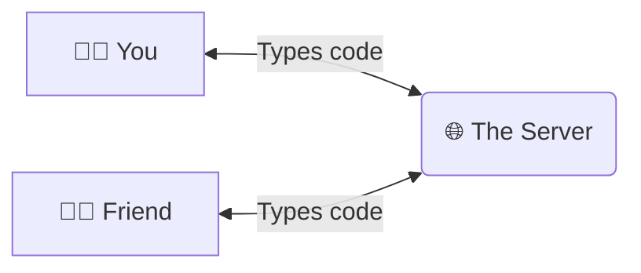
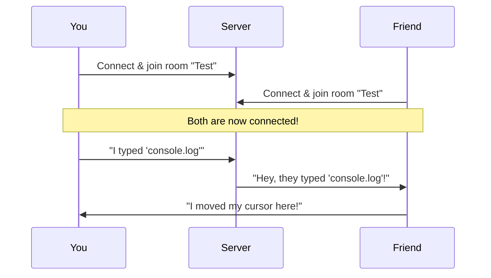
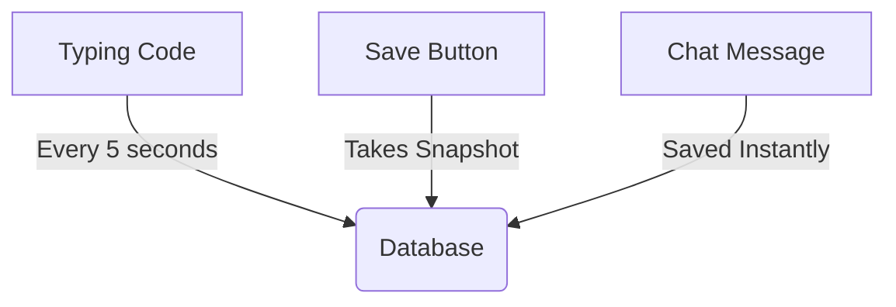

# How RTCE Works: A Simple Guide! 🚀

Ever wondered how multiple people can type in the same document at the same time without the text getting all jumbled up? This guide explains the magic behind **RTCE (Real-Time Collaborative Code Editor)** in plain English!

---

## 1. The Big Picture 🌍

Imagine you and your friend are drawing on the same piece of paper, but you are in different cities. You need a magical messenger who instantly copies what you draw onto your friend's paper, and vice versa. 

In RTCE, that magic is made of three main parts:
1. **The Client (Your Browser):** The drawing paper.
2. **The Server (The Backend):** The magical messenger.
3. **The Sync Engine (Yjs):** The rules that stop you and your friend from drawing over each other.

---

## 2. Dealing with Conflicts (The Yjs Magic) 🪄

What happens if you type "Hello" at the exact same time your friend types "World" on the same line? 

Normally, the computer wouldn't know which one to put first. This is where **Yjs (a CRDT - Conflict-free Replicated Data Type)** comes in. 

Think of Yjs like giving a unique, invisible serial number to *every single letter* you type.

- You type 'A' -> ID: 1.1
- You type 'B' -> ID: 1.2
- Friend types 'C' -> ID: 2.1

Because everything has an exact decimal-like ID, the system always knows exactly what goes where, no matter whose internet is faster. No conflicts!

---

## 3. How the Message Travels (Socket.io) ⚡

To send those letters back and forth instantly, we use something called **WebSockets** (specifically a tool called **Socket.io**).

Usually, browsers ask the server for a webpage, wait, get it, and then close the connection. 
With WebSockets, the browser calls the server and says, *"Hey, keep the phone line open!"*

Every time you type, move your cursor, or send a chat message, Socket.io throws that package of data through the open phone line to the Server, which immediately throws it down the lines to everyone else in the room.

---

## 4. Remembering the Code (The Database) 💾

If everyone leaves the room and closes their laptops, the code would be lost... unless we save it!

We use **SQLite (with sql.js)** to remember:
* What the code looked like when you left (so when you rejoin, it's still there!)
* The chat messages you sent.
* **Version History:** Every time you hit "Save", we take a "photograph" of the document and stash it in the database. When you click "Revert", we pull that photograph out and put it back on the screen.

---

## Summary 🙌

1. You type in the **Monaco Editor** (the same editor VS Code uses!).
2. **Yjs** packages your keystroke with a smart ID.
3. **Socket.io** shoots that package to the server at lightspeed.
4. The **Server** passes it to your friends and saves a backup to the **Database**.
5. Your friends see your cursor move and the code appear instantly.

And that is how RTCE lets you code together perfectly, every single time! 
